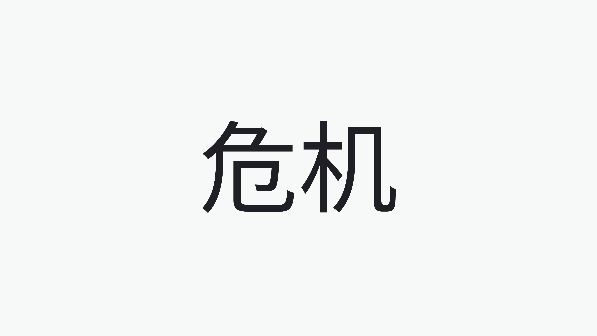

The initial idea was to write a bit about each destination while we visited them, but here I am after two months. It's just taken me a bit longer to put a very simple site together 💀.

This post is going to be short; it's about closing an open milestone. I intend to get back to it at some point.

It has definitely been a mix of emotions: adventure, frustration, exhaustion, and overwhelming at times.

We're traveling, but it's not a holiday, and it's not our home. I'm still working, but I have no proper work setup. Yet, I need to be productive and feel like I'm shipping and supporting my team.

The most challenging part is the logistics, with accommodation as the top issue. Transportation is less of a problem; staying around Europe, trains are reliable and cheaper. On top of that, July and August are summer holidays, with the Olympic Games happening in Paris and Euro 2024 in Germany.

The most important part is that our family is stronger than ever. We have our down moments, but everyone is happy and healthy. It's been more than four years since we left the EU. We are learning new things about languages and culture, and having a different perspective helps with the changes.

This experience has been about embracing the unknown and acknowledging that we are tiny beings with no control whatsoever. There are a lot of things that could go wrong on this trip, and sometimes I think about them: what if someone gets hurt? What if I need to run to A&E? And so on...

While writing the paragraph above, I thought about the Chinese word Wei Ji, which represents "danger/crisis but also opportunity."

This pretty much sums up how this journey began back in February when we had to vacate our home and found ourselves with nowhere to go. We saw an opportunity, and I'm glad we embraced it.